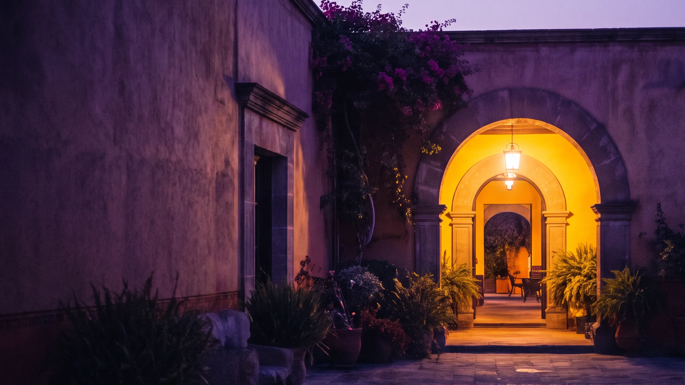

# Mayordommo embed guide

Copy `web/*.webp` and `logo/*.svg` into the landing folder and reference them relatively. Tokens (colours) come from `tokens.json` / `DESIGN.md`; never hardcode a hex that is not in `palette.md`. Text (wordmark, tagline, headlines) is real type: Marcellus 400 (display, no bold or italic: set `font-synthesis: none`) + Manrope (UI), never baked into images. Self-host both with `@font-face` and `font-display: swap`; do not link Google Fonts in production.

## Hero (night section)
```html
<section class="hero">
  <picture>
    <source media="(max-width:700px)" srcset="web/hero-courtyard-dusk-1280.webp">
    
  </picture>
  <div class="hero-copy"><!-- headline sits on the clean left two thirds --></div>
</section>
```
```css
.hero{position:relative;min-height:100svh;background:#160C24;color:#F4EFF8}
.hero img{position:absolute;inset:0;width:100%;height:100%;object-fit:cover;object-position:70% 50%}
.hero::after{content:"";position:absolute;inset:0;background:linear-gradient(90deg,#160C24cc 0%,#160C2400 55%)}
.hero-copy{position:relative;z-index:1;max-width:36rem;padding:clamp(24px,6vw,96px)}
```
The same still is the first frame of the scroll video and the poster / reduced-motion fallback.

## Cards and sections
Use the `-1280.webp` files for cards (`loading="lazy"`, `decoding="async"`, explicit width/height, `object-fit:cover`). Photos sit on dark sections; bone sections (`#F4ECE0`) stay photo-free or use the door-hanger (`tarjeta-puerta-oro`).
Dark-theme cards and pop-ups get the purple glow (`box-shadow:0 0 0 1px #AB81F255,0 8px 36px -8px #AB81F266`); light-theme cards get an Aubergine Ink hairline and no glow.

## Logo and favicon
```html
<link rel="icon" href="logo/mayordommo-flat-dark.svg" type="image/svg+xml">
 <!-- >=40px: full mark -->
```
Below 40px use `mayordommo-flat-*.svg`. Leave clear space under the logo so the reflection ends before the wordmark.

## Don'ts
No text over a busy part of a photo without the gradient above; no purple glow in the light theme; no gold except "a person is needed" and the doorway light.
